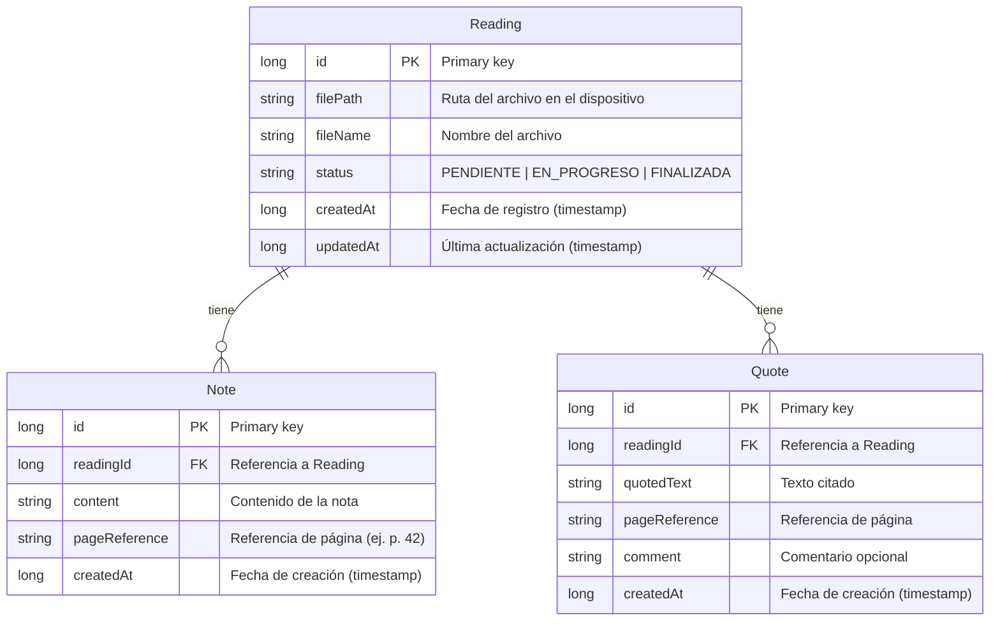

# Modelo de base de datos — BookLog

Modelo de datos para la persistencia local con Room (SQLite). Diseñado para lecturas, notas, citas y referencias de página.

## Diagrama entidad-relación

## Descripción de entidades

| Entidad   | Descripción |
|-----------|-------------|
| **Reading** | Archivo de lectura seleccionado del dispositivo. Incluye ruta, nombre y estado (pendiente, en progreso, finalizada). |
| **Note**    | Nota personal asociada a una lectura, con referencia de página opcional. |
| **Quote**   | Cita textual asociada a una lectura, con referencia de página y comentario opcional. |

## Relaciones

- Una **Reading** puede tener muchas **Note** (1:N).
- Una **Reading** puede tener muchas **Quote** (1:N).
- **Note** y **Quote** pertenecen siempre a una **Reading** (clave foránea `readingId`).

## Notas de implementación (Room)

- Los tipos `long` para fechas se pueden mapear con `TypeConverter` desde `Date` o `Instant` si se prefiere en el dominio.
- El campo `status` en `Reading` se implementa como `enum` con `TypeConverter` para guardar como texto en SQLite.
- Índices recomendados: `readingId` en `Note` y `Quote` para consultas y relaciones eficientes.
