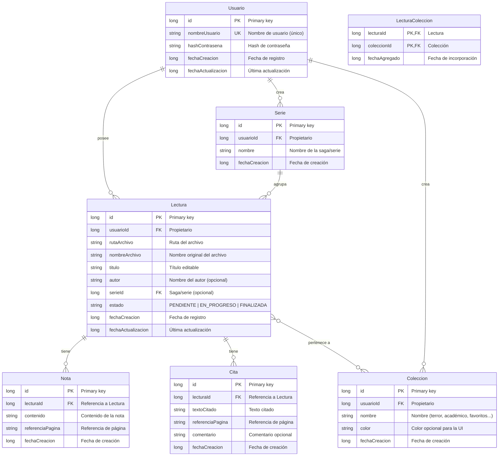
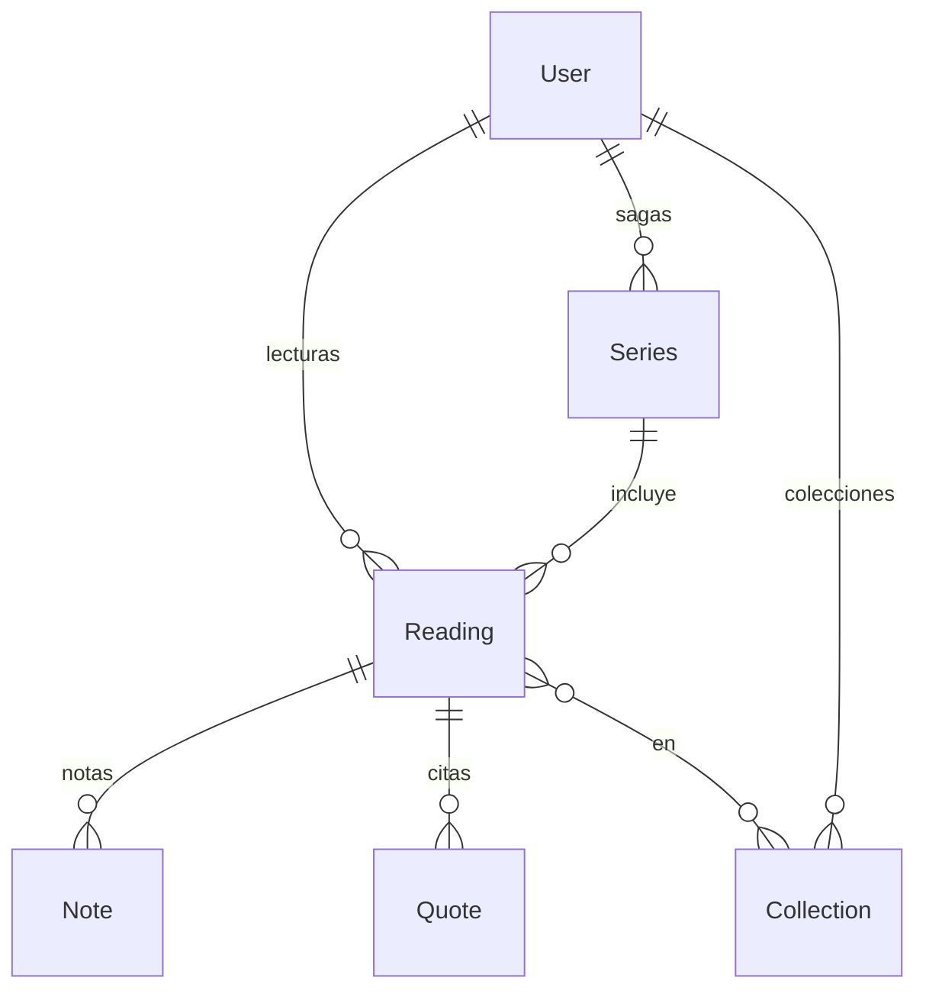

# Modelo de base de datos V2 — BookLog

Modelo de datos para la persistencia local con Room (SQLite). Incluye autenticación, metadatos de lecturas (título, autor, saga), colecciones y la gestión de notas y citas.

---

## Diagrama entidad-relación

---

## Diagrama simplificado (vista general)

---

## Descripción de entidades

| Entidad | Descripción |
|---------|-------------|
| **Usuario** | Usuario de la aplicación. Autenticación con `nombreUsuario` y `hashContrasena`. |
| **Serie** | Saga o serie literaria (ej. "Harry Potter", "El Señor de los Anillos"). Opcional por lectura. |
| **Coleccion** | Colección o categoría creada por el usuario (terror, académico, favoritos, etc.). |
| **Lectura** | Archivo de lectura con metadatos: `titulo` editable, `autor`, saga y `estado`. |
| **LecturaColeccion** | Tabla de unión N:M entre `Lectura` y `Coleccion`. Un libro puede estar en varias colecciones. |
| **Nota** | Nota personal asociada a una lectura, con `referenciaPagina` opcional. |
| **Cita** | Cita textual asociada a una lectura, con `referenciaPagina` y `comentario` opcionales. |

---

## Relaciones

| Relación | Tipo | Descripción |
|----------|------|-------------|
| Usuario → Lectura | 1:N | Un usuario tiene muchas lecturas. |
| Usuario → Serie | 1:N | Un usuario define sus propias sagas. |
| Usuario → Coleccion | 1:N | Un usuario crea sus colecciones. |
| Serie → Lectura | 1:N | Una saga puede incluir varias lecturas. |
| Lectura → Nota | 1:N | Una lectura puede tener muchas notas. |
| Lectura → Cita | 1:N | Una lectura puede tener muchas citas. |
| Lectura ↔ Coleccion | N:M | Una lectura puede estar en varias colecciones; una colección puede contener varias lecturas. |

---

## Campos nuevos o modificados respecto a V1

| Entidad | Campo | Tipo | Descripción |
|---------|-------|------|-------------|
| Lectura | `usuarioId` | FK | Propietario de la lectura. |
| Lectura | `titulo` | string | Título editable (puede diferir del `nombreArchivo`). |
| Lectura | `autor` | string | Nombre del autor (opcional). |
| Lectura | `serieId` | FK (nullable) | Saga o serie a la que pertenece (opcional). |

---

## Notas de implementación (Room)

- **TypeConverters**: Usar para `status` (enum) y fechas (`Date`/`Instant` ↔ `Long`).
- **Índices**: Los definidos en el script mejoran consultas por `userId`, `readingId`, `seriesId` y `collectionId`.
- **Seguridad**: Nunca almacenar contraseñas en texto plano; usar BCrypt o Argon2 para el hash.
- **Cascadas**: Al eliminar un usuario, se eliminan sus lecturas, series, colecciones y relaciones asociadas.
